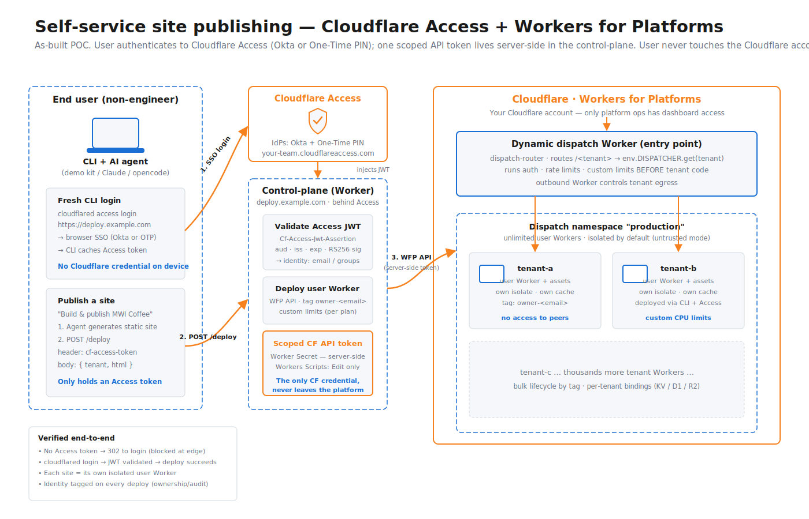
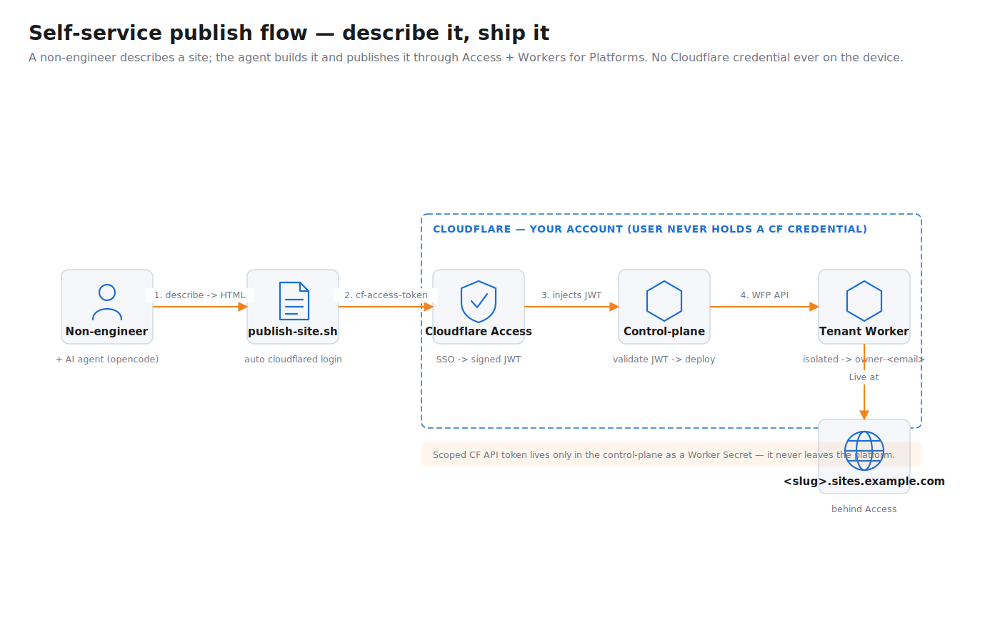

# Self-Service Static Hosting Kit — Cloudflare Access + Workers for Platforms

Let non-engineers publish static sites — by describing them to an AI agent or via a
one-line CLI — **without ever giving them access to your Cloudflare account**, with
**per-site isolation** and a clean **ownership / audit** model.

This kit is a working reference implementation you can drop in, configure with your
own account/domain, and deploy. It has three moving parts plus an AI/CLI publisher.

---

## What you'll build



| Component | What it is | Folder |
|---|---|---|
| **Dispatch router** | Platform entry point. Routes `<tenant>.sites.example.com` (hostname) and `/<tenant>/` (path) to the tenant's isolated Worker. Where you run auth, rate limits, custom limits, and egress control *before* tenant code. | `platform/dispatch-router/` |
| **Control-plane** | Deployer behind **Cloudflare Access**. Validates the Access JWT, then deploys the user's site as an **isolated user Worker** into the Workers-for-Platforms dispatch namespace, tagged `owner-<email>`. | `platform/control-plane/` |
| **Tenant Workers** | Each published site = its own isolated Worker (own isolate, own cache, no peer access) inside one dispatch namespace. Unlimited tenants. | `platform/tenant-example/` |
| **Publisher (AI/CLI)** | `publish-site.sh` + `AGENTS.md`. A non-engineer describes a site in English; the agent generates one self-contained HTML file and publishes it. Auto-runs `cloudflared access login` if needed. | `publisher/` |

---

## How a publish works



**Key point up front: the person publishing never runs `wrangler` and never holds a
Cloudflare credential.** On their machine the flow is just two ordinary tools —
`cloudflared` (to get a short-lived Access token) and an HTTPS `POST` (via `curl`) to
the control-plane's `/deploy` endpoint. The only thing that ever calls the Cloudflare
API is the **control-plane Worker**, server-side, using a scoped token that never
leaves the platform.

> There are **two separate deploy paths**, and it's easy to conflate them:
>
> | Path | Who runs it | Tool | Talks to |
> |---|---|---|---|
> | **Platform install** (one-time) | You, the operator, with a real API token | `wrangler deploy` | Cloudflare Workers API |
> | **Self-service publish** (every day) | The non-engineer via this kit | `cloudflared` + `curl` (HTTP) | the control-plane Worker's `/deploy` |
>
> `wrangler` appears **only** in the one-time install of the three platform Workers
> (see [QUICKSTART.md](QUICKSTART.md)). The day-to-day publish path deliberately uses
> **no wrangler and no CF credential** — that's the whole isolation guarantee.

### Step by step — what happens when someone publishes

1. **Describe + generate.** A non-engineer (optionally via an AI agent that auto-loads
   `publisher/AGENTS.md`) describes the site in English. The agent writes **one
   self-contained `.html` file** into `publisher/` (all CSS/JS inline, no external
   fetches — see the site constraints in `AGENTS.md`).

2. **Run `./publish-site.sh <slug> <file.html>`.** No account ID, no API token, no
   wrangler. The script (`publisher/publish-site.sh`) does three things:
   - **Gets a Cloudflare Access token via `cloudflared`** — `cloudflared access token
     -app=$DEPLOY_URL`; if none is cached it auto-runs `cloudflared access login`
     (browser SSO via your IdP — Okta / OTP / etc.). This is an **Access** token scoped
     to the deploy app only — *not* a Cloudflare API token or account access.
   - **Builds the JSON body `{ tenant, html }`** — the HTML file becomes one JSON string.
   - **Sends a plain HTTPS `POST $DEPLOY_URL/deploy` with `curl`**, carrying the Access
     token in the `cf-access-token` header. That's the entire local footprint: an
     authenticated HTTP request to a Worker.

3. **Cloudflare Access enforces auth at the edge.** Because the control-plane hostname
   sits behind an Access application, an **unauthenticated** `POST` gets a **302 to the
   login page before the Worker ever runs**. A valid request has the signed JWT injected
   as the `Cf-Access-Jwt-Assertion` header.

4. **The control-plane Worker is the only thing that calls the Cloudflare API**
   (`platform/control-plane/worker.js`):
   - Re-validates the Access JWT itself — `aud` / `iss` / `exp` + RS256 signature against
     your team's JWKS (`/cdn-cgi/access/certs`). Defense-in-depth on top of edge Access.
   - Wraps the submitted HTML into a tiny tenant Worker and builds a multipart upload
     tagged `tenant-<slug>` and `owner-<email>` (identity from the JWT claims).
   - **`PUT`s it to the Workers for Platforms REST API** using the **server-side scoped
     token** (a Worker Secret):
     `PUT /client/v4/accounts/{ACCOUNT_ID}/workers/dispatch/namespaces/{NAMESPACE}/scripts/{slug}`
   - Returns `{ url, message: "Live at …" }`, which `publish-site.sh` echoes as
     `✅ Live at …`.

5. **Serving.** A visit to `https://<slug>.sites.example.com/` hits the **dispatch
   router** Worker, which does `env.DISPATCHER.get(<slug>)` and forwards the request to
   that tenant's isolated user Worker (also reachable via the path form `/<slug>/`).

**The end user never holds a Cloudflare credential.** The one scoped API token lives
only inside the control-plane as a Worker Secret and never leaves the platform.

---

## Why this model

- **Isolation** — user Workers run untrusted; no shared cache, no peer access. One
  dispatch namespace scales to thousands of tenants.
- **No credential sprawl** — users authenticate to **Cloudflare Access** (Okta, OTP,
  or your IdP), not to the Cloudflare account. One scoped token, server-side only.
- **Governance before tenant code** — the dispatch router is the choke point for auth,
  rate/CPU limits, and egress control, applied *before* any tenant code runs.
- **Ownership & escalation** — every deploy is stamped with the caller's Access
  identity (`owner-<email>`) for a clean audit trail and one-call teardown by tag.
- **Single sign-on, per-app policy** — one IdP login can cover both the deploy app and
  the `*.sites.example.com` sites, while each Access application keeps its **own policy
  and its own per-audience session** (independent authorization and audit per app).

---

## Get started

See **[QUICKSTART.md](QUICKSTART.md)** — ~20 minutes end to end. In short:

1. Prereqs: Workers for Platforms add-on, Cloudflare Access (Zero Trust), a zone,
   `node`/`bun` + `wrangler`, and `cloudflared`.
2. Create a dispatch namespace, deploy the router and control-plane.
3. Put a scoped API token in the control-plane secret; front the control-plane with
   an Access app; wire the `*.sites.example.com` wildcard.
4. `cp config.example.sh config.sh`, fill it in, and publish your first site.

## Repo layout
```
wfp-access-hosting-kit/
├── README.md                     ← you are here
├── QUICKSTART.md                 ← step-by-step setup
├── config.example.sh             ← copy to config.sh, set DEPLOY_URL
├── platform/
│   ├── control-plane/            ← Access-protected deployer (Worker)
│   ├── dispatch-router/          ← hostname + path dispatch (Worker)
│   ├── tenant-example/           ← a multi-file tenant site (Worker + assets)
│   └── setup-wildcard-hostnames.sh
├── publisher/
│   ├── AGENTS.md                 ← teaches the AI agent the publish loop
│   ├── publish-site.sh           ← the one command that publishes a site
│   └── examples/coffee-campaign.html
└── diagrams/
    ├── architecture.svg
    ├── publish-flow.svg
    └── _build_diagrams.py        ← regenerate publish-flow.svg
```

## Accelerators (if you'd rather not hand-roll)
- **Workers for Platforms Starter Kit** (`worker-publisher-template`) — dispatch
  namespace + dispatch Worker + deploy endpoint, close to this kit's platform half.
- **VibeSDK** (https://github.com/cloudflare/vibesdk) — Cloudflare's open-source
  "describe it, AI builds + deploys it" platform. Closest to the AI publisher half.
